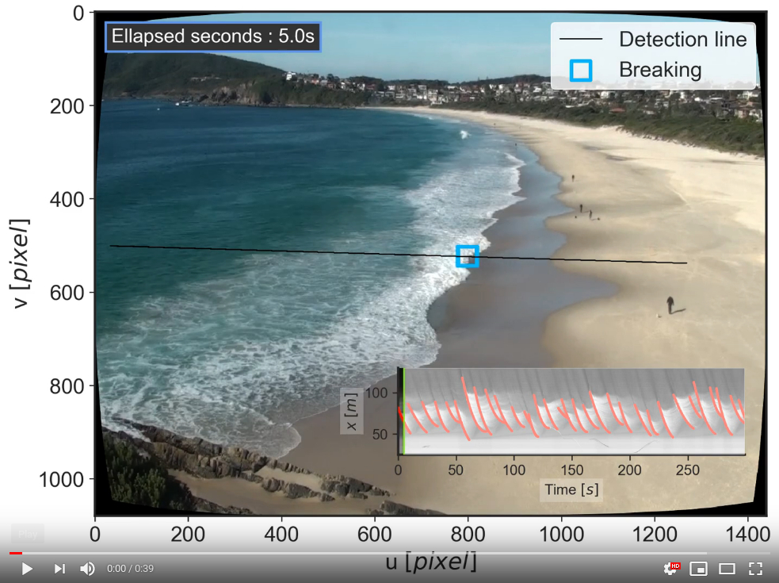

# PyWaveLearn (PWL)
Machine learning for wave enthusiasts.


[](https://zenodo.org/badge/latestdoi/110203516)


This repository makes available some useful tools for coastal scientists to
handle common nearshore data with special focus on data mining,
machine learning, and big data.

The work presented here was originally designed as supporting material for the paper: **"A Novel Machine Learning Algorithm for Tracking Remotely Sensed Waves in the Surf Zone"**.

The accepted manuscript can be obtained [here]( https://www.sciencedirect.com/science/article/pii/S037838391830228X).

The main task handled here is to detect wave breaking, as explained in
[this notebook](notebooks/learn_wavebreaking.ipynb), and shown in this animation (click to play):

[](https://youtu.be/UTxsNOywCno)

<!--  -->


# Installation:

At the moment, pywavelearn can only be installed from the source code.

We strongly recommend to use Anaconda (available from [here](https://www.anaconda.com/download/#linux)) to handle all the dependencies.

Make sure you have all the dependencies:

```bash
# create a new environment
conda create --name pwl python=3.6  # netCDF4 DOES NOT work with python 3.7 yet
# activate
source activate pwl
# install the netCDF4 and xarray
conda install netCDF4 xarray
# install seaborn for better plots
conda install seaborn
# colour analysis
pip install colorspacious
conda install -c conda-forge colour-science
# OpenCV
conda install -c menpo opencv
# science kits
conda install scikit-image scikit-learn
# heavy machine learning machinery - not needed for the basic tools
sudo apt-get install gcc gfortran
conda install cython tensorflow keras
pip install xgboost
# a nice progress bar
conda install -c conda-forge tqdm
# peak detection
pip install peakutils
# dealig with shapefiles - Fiona is too unstable to be trusted...
pip install pyshp simpledbf
conda install pytables sqlalchemy
```

You may also want ffmpeg and some codecs to process raw video data (Ubuntu-only).
```bash
sudo apt install ffmpeg ubuntu-restricted-extras
```

Now, install pywavelearn:

```bash
git clone https://github.com/caiostringari/pywavelearn.git
cd pywavelearn
sudo python setup.py install
```

# pwl.image
The module **image** was designed to make it easier to rectify ARGUS-like
images using the OpenCV and scikit-image packages. Most of the heavy lifting is
done using [Flamingo](http://flamingo-image.readthedocs.io/). This module has
the companion script [extract_timestack.py](scripts/extract_timestack.py) which
extracts space-time transects (timestacks) from a set of coastal images and also
has the option to store rectified frames in a netCDF4 structure suitable for big
data analysis.

Usage examples are available [here](doc/pwl_image.md).

# pwl.colour
The module **colour** is the basis for most of the machine learn tasks available
in this package. It exploits the fact that unbroken waves, broken waves, and
the shoreline have different colour signatures that can be used to "learn"
information about these features.

The [wave breaking detection](scripts/learn_wavebreaking.py) script shows the full
potential of the colour module.

Usage examples are available [here](doc/pwl_colour.md).


# pwl.stats, pwl.spectral and pwl.linear

The modules **stats**, **spectral** and **linear** contain tools to
deal with the most common wave analysis problems. They provide ways to calculate
wave heights, periods, spectral densities, and most of the parameters derived
from the linear wave theory.

Usage examples are available [here](doc/pwl_stats_spectral_and_linear.md).

# scripts

Most of the functions available across the various modules have a Command Line
Interface (CLI) companion. The most important ones are:

1. [calibrate_camera.py](scripts/calibrate_camera.py)
1. [extract_frames.py](scripts/extract_frames.py)
2. [get_gcp_uvcoords.py](scripts/get_gcp_uvcoords.py)
3. [extract_timestack.py](scripts/extract_timestack.py)
4. [learn_wavebreaking.py](scripts/learn_wavebreaking.py)

The full help for these scripts can be seen using
```python script_name.py --help```.

**TODOS:**

1. Improve documentation
2. Add continuous integration (CI)


<!-- # pwl.sensors
TODO:

1. Add docs
2. Work on RBR PT parser
3. Work on Sontek ADV parser -->
