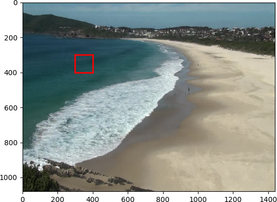

This module's main task is to provide a neat way to compare and
classify colours.

Let's load an image and perform some tasks:

```python
import numpy as np
import skimage.io
from skimage.util import img_as_uint
import pywavelearn.colour as cpwl

# read frame
img = skimage.io.imread("image/OMB.jpg")
```


We can start, for example, by reducing the number of colours in the image:

```python
img8bit = cpwl.colour_quantization(img, ncolours=8)
```


Next, we can try to subset and classify some region in the image:

```python
# subset the image
i = 300
j = 300
di = 100
dj = 100
I = img[i:i+di,j:j+dj,:]

# get color bands
snap_colours = np.vstack([I[:, :, 0].flatten(),
                          I[:, :, 1].flatten(),
                          I[:, :, 2].flatten()]).T
user_colours = np.vstack([[0, 0, 0],[255, 255, 255],[0, 0, 255]]).T
colour_labels = [0,1,2]  # 0 is black, 1 is white, and 2 is blue

# classification step
labels = []
for rgb in snap_colours:
  label = cpwl.classify_colour(rgb, user_colours, colour_labels)[0]
  labels.append(label)

# Let's see the results
import matplotlib.pyplot as plt
import matplotlib.patches as patches

# return to original shape
L = np.array(labels).reshape(I.shape[0],I.shape[1])

# show the region for verification
fig, (ax1) = plt.subplots()
ax1.imshow(img)
rect = patches.Rectangle((j, i), di, dj,fill=False,lw=2,color="r")
ax1.add_patch(rect)

# print results
print ("Predicted averaged label:",L.mean().astype(int))

plt.show()
```

`Predicted averaged label: 2`




A better way to assess the prediction would to use the concept of dominant
colour instead of simply averaging the values. It can be done using the
```get_dominant_colour()``` function:

```python
import pandas as pd
# build a dataframe with RGB values
df = pd.DataFrame(np.vstack([I[:,:,0].ravel(),
                             I[:,:,1].ravel(),
                             I[:,:,2].ravel()]).T,
                             columns=["r","g","b")
# add labels and region names
df["region"] = ["water"]*len(L.ravel())
df["label"] = 2

label, region, rgb = cpwl.get_dominant_colour(df, n_colours=8)

# print results
print ("Predicted dominant label:",label[0].astype(int))
```

`Predicted dominant label: 2`
