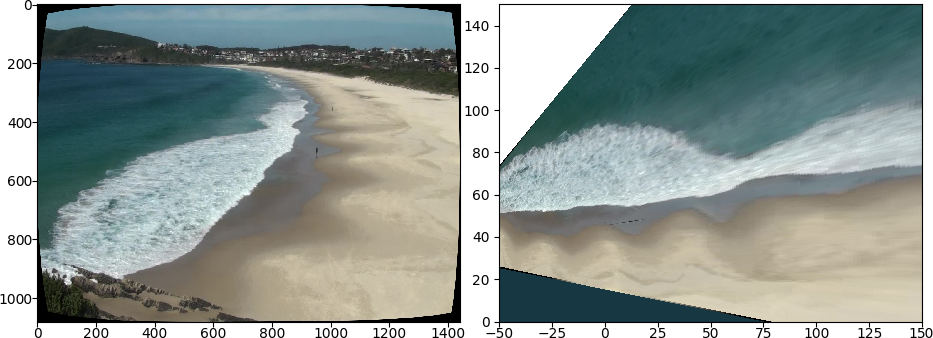
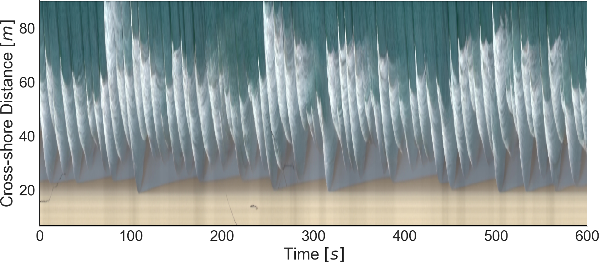

# Single frame rectification

This module main functions is to provide easy ways to rectify raw imagery, and
to extract timestacks.

Assuming that we know the camera intrinsic and extrinsic parameters and the
coordinates of few GCPs in both metric and pixel coordinate systems, the
rectification procedure looks something like this:

```python
import cv2
import skimage.io
import pandas as pd
from pywavelearn.image import find_homography, rectify_image, camera_parser

# read the camera intrinsic parameters
K,DC = camera_parser("../data/Calibration/CameraCalib.txt")

# read frame
I = skimage.io.imread("../data/Image/OMB.jpg")
h,  w = I.shape[:2]

# read GCPs coordinates
XYZ = pd.read_csv("../data/Image/xyz.csv")[["x","y","z"]].values

# read UV coords
UV = pd.read_csv("../data/Image/uv.csv")[["u","v"]].values

# undistort frame
Kn,roi = cv2.getOptimalNewCameraMatrix(K,DC,(w,h),1,(w,h))
I = cv2.undistort(I, K, DC, None, Kn)

# find homography assuming that the projection height is 0 and there are no
# distortions
H = find_homography(UV, XYZ, K, z=0, distortion=0)

# rectify coordinates
X,Y = rectify_image(I, H)
```

The resulting images should something like this:



**Notes:**
1. If you don't already have the camera calibration file,
[this script](../scripts/calibrate_camera.py) can be used to generate a valid file.
2. If you don't know the GCPs' pixel coordinates, use [this GUI](../scripts/get_gcp_uvcoords.py).

# Batch processing

In order to rectify a series of frames and to extract timestacks, the script
[extract_timestack.py](../scripts/extract_timestack.py) was designed. It
supports multi-processing via [multiprocessing](https://docs.python.org/2/library/multiprocessing.html)
module. Although this script was originally designed to extract timestacks,
it also supports saving rectified frames to netCDF4 files.

A simplified usage example would look like this:

```bash
echo "# Running extract_timestack.py, please wait.."

# set number of processors
nproc=1

# timestack coordinates
x1=0.
x2=0.
y1=25.0
y2=130.0

# rectification height
Z=0

# rotation
R=0.0

# translation
X=0.0
Y=0.0

# horizon
H=1000

# camera calibration file
cm="../data/Calibration/CameraCalib.txt"

# GCP files
uv="../data/Image/uv.csv"
xyz="..data/Image/xyz.csv"

# number of points in the timestack line
pts=300

# pixel window size
win=1

# frames
ipath="../data/PyArgus/frames/"

# timestack name
timestack="omb_timestack.nc"

# call the main script
python ../scripts/extract_timestack.py --nproc $nproc -i $ipath         \
                                       -o $timestack                    \
                                       -xyz $xyz -uv $uv                \
                                       -X $X -Y $Y -theta $R --Z $Z     \
                                       -x1 $x1 -x2 $x2 -y1 $y1 -y2 $y2  \
                                       --horizon $H --camera-matrix $cm \
                                       --stack-points $pts --pxwin $win \
                                       --pixel-statistic 'mean'         \
                                       --save-frames
done
```

The resulting timestack looks like this:



**Notes:**
1. Do not use this script on a regular laptop. Although it will run just fine,
it was designed to run in a HPC facility.
2. This script should work with [PBS](http://www.arc.ox.ac.uk/content/pbs)
out-of-the-box.
3. For a full description of its powers, use
```python extract_timestack.py --help```.
