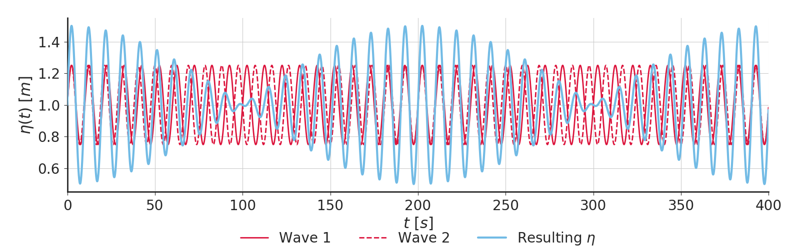
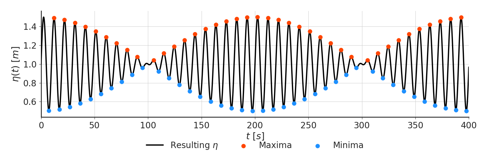

# Spectral parameters

Let's start by creating a modulated sinuisdal wave.

```python
tmax = 400
fs = 1./0.1  # 1/Hz
t = np.arange(0, tmax, 1./fs)

# first wave
t1 = 10.  # wave period [s]
f1 = 1./t1  # wave frequency [Hz]
a1 = 0.25  # wave amplitude [m]
l1 = 10  # wave lenght [m]
h1 = 1  # water depth [m]
o1 = 2*np.pi/t1  # wave angular frequency [2*pi/s]
w1 = h1+(a1*np.sin(o1*t))

# second wave
t2 = 10.  # wave period [s]
f2 = 1./t2  # wave frequency [Hz]
a2 = 0.25  # wave amplitude [m]
l2 = 10  # wave lenght [m]
h2 = 1  # water depth [m]
o2 = 2*np.pi/t2  # wave angular frequency [2*pi/s]
delta = 1.05
w2 = h2+(a2*np.sin(o2*t*delta))

# resulting wave
wt = w1+w2
```

Our resulting wave should look like this:


Let's calculate Power Spectrum Density (PSD):

```python
from pywavelearn.spectral import power_spectrum_density

f, psd = power_spectrum_density(wt, fs, window='hann', plot=True)
```

# Statistical analysis from the spetrum

Most of the statistics available in Holthuijsen (2007) - Waves in Oceanic
and Coastal Waters were implemented in the **stats** module.

For example, from the PSD, we can calculate wave heights and periods.

```python
from pywavelearn.stats import Hm0, Tm01, Tm02

Hm0a = Hm0(f, psd)
Tm01a = Tm01(f, psd)
Tm02a = Tm01(f, psd)

print("Significant wave heigh :", np.round(Hm0a, 1))
print("Significant wave period :", np.round(Tm01a, 1))
print("Zero-crossing wave period :", np.round(Tm02a, 1))
```
```Significant wave heigh : 1.0```

```Significant wave period : 9.8```

```Zero-crossing wave period : 9.8```


Or, if you don't have the PSD yet:

```python
from pywavelearn.stats import HM0, TM01, TM02

Hm0a = HM0(wv, fs)
Tm01a = TM01(wv, fs)
Tm02a = TM01(wv, fs)
```

Which should produce exactly the same results as before.

# Wave-by-wave statistical analysis

Maybe one of the most powerful/useful tools in this package is its ability
of perform high-level wave-by-wave analysis. Instead of the traditional
zero-crossings approach, it implements a iterative and procedural search for
local minima and maxima on the data that should overcome the major shortcomings
of the zero-crossing methods

```python
from pywavelearn.utils import peaklocalextremas
mins, maxs = peaklocalextremas(wt, lookahead=10, delta=0.025)
```



We can calculate the similar statistics as before, but now from the
raw record.

```python
from pywavelearn.utils import peaklocalextremas
from pywavelearn.stats import (significant_wave_height,
                               significant_wave_period)

# make sure to always start and end with a local minima
if t[mins[0]] > t[maxs[0]]:
    maxs = np.delete(maxs, 0)
if t[mins[-1]] < t[maxs[-1]]:
    maxs = np.delete(maxs, -1)

heights = []
periods = []
# considering a wave defined as two consecutive troughs
for i in range(len(mins)-1):
    i1 = mins[i]
    i2 = mins[i+1]
    single_wave = wt[i1:i2]
    heights.append(single_wave.max()-single_wave.min())
    periods.append(t[i2]-t[i1])

print("Significant wave height:", np.round(Hs, 1))
print("Significant wave period:", np.round(Ts, 1))
```

Resulting in:

```Significant wave height: 1.0```

```Significant wave period: 10.6```

Which is quite similar to the spectral values obtained before.

# Linear wave theory

It's inevitable, one of these days you will need to perform some good old Airy
wave theory calculations. The module **linear** should make your life a little
bit easier. This module revamps  [Christoher H. Barker](https://github.com/ChrisBarker-NOAA/wave_utils)'s original package with
some new functions and better documentation. Some of the implemented are:

```python
from numpy import pi
from pywavelearn.linear import *

# define a water depth
h = 2.0
# define a non-dimensional water depth
p = 1.2
# define a wave period
T = 10
# wave an angular frequency
omega = 2*pi/T

# wave number
k = wave_number(omega)

# wave angular frequency
omega  = frequency(k)

# wave celerity at any depth
c = celerity(k,h)

# wave group speed at any depth
cg= group_speed(k,h)

# dispersion relation for a non-dimensional water depth
q = dispersion(p)
```
